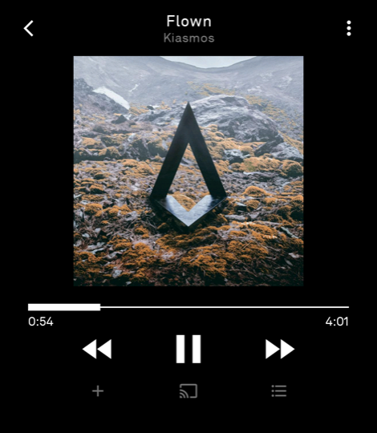
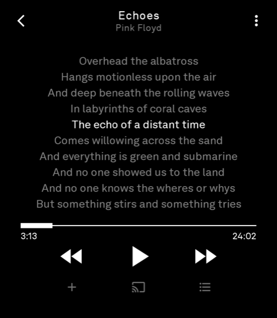
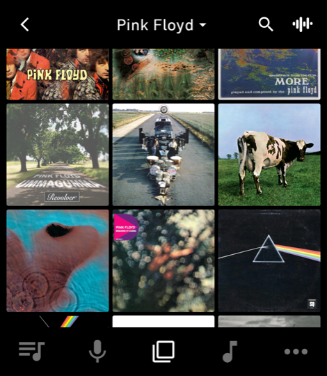
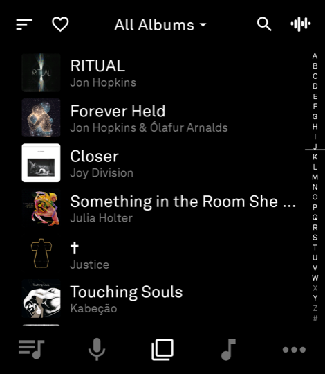

# Amp

**(A)nother (M)usic (P)layer**, for the Light Phone III.

Plays your own library — a Subsonic server, Plex, or files on the phone — and is
built on Light's SDK, so it looks like it belongs there.

<p align="center">
  
  
  
  
</p>

<p align="center"><em>Colour is optional and off by default — the Light Phone III
is greyscale unless you turn its filter off. See <a href="#what-isnt-in-the-sdk-yet">below</a>.</em></p>

> Side-load only for now. The tool store isn't open yet.
>
> For advanced users at this stage — installing means USB debugging and `adb`,
> and things will break.

## Features

- Subsonic (Navidrome, Airsonic, Gonic), Plex, and files on the phone — several
  at once, each with its own downloads, settings and cache.
- Bandcamp [speaks Subsonic](https://blog.bandcamp.com/2026/07/16/discover-improvements-and-subsonic-implementation/)
  now, so you can use Amp without hosting anything.
- Offline downloads, by album, track, or everything you've liked.
- Separate streaming quality for wifi and cellular.
- Synced lyrics, from your server or [lrclib.net](https://lrclib.net).
- Play counts, ratings, likes and playlist edits sync back to the server.
- Cast to a DLNA speaker or receiver.
- Artwork can be turned off completely.

I've been using it as my only music player for a week, on a library of about
8,000 tracks with 50GB downloaded.

## Installing

USB debugging needs to be on: **Settings → Developer options → Allow USB
debugging**. Then take the APK from [Releases](../../releases) and either drop
it on [Light Phone Manager](https://github.com/greghare/light-phone-manager), or:

```bash
adb install -r amp-*.apk
```

## Music on the phone

Amp reads `Music/Amp`, and nothing else.

```bash
adb push ~/Music/some-album "/sdcard/Music/Amp/"
```

Sub-folders are fine. Names come from the tags rather than the folders, and
artwork has to be embedded in the files — a `cover.jpg` next to them won't show.

Playlists live in `Music/Amp/Playlists` as `.m3u8`, so one you make on the phone
opens anywhere else, and one you drop in that folder shows up in Amp.

## What isn't in the SDK yet

Four things sit outside the official SDK. **Background audio** and **background
downloads** are the two that stop this being a plain SDK tool. **Colour** and
**DLNA casting** are extras that would come out for a store build.

What each stands in for, and what would replace it, is in
[SDK gaps](tool/docs/SDK-GAPS.md). The SDK changes themselves are listed with
revert steps in [SDK patches](tool/docs/SDK-PATCHES.md).

Colour is the only one you have to do anything about. It's off by default, and
switching the phone's greyscale filter needs a one-time grant:

```bash
adb shell pm grant com.sublunar.amp android.permission.WRITE_SECURE_SETTINGS
```

Then turn off **Settings → Monochrome Artwork**.

## Building

This repo is [lightphone/light-sdk](https://github.com/lightphone/light-sdk) with
the app in its `tool/` module, which is the shape a LightOS tool takes.

```bash
./gradlew :tool:assembleRelease
```

## Licence

MIT. The app is © Amp contributors; the rest is Light's SDK, © The Light Phone,
carried here with our changes on top. See [LICENSE](LICENSE).
